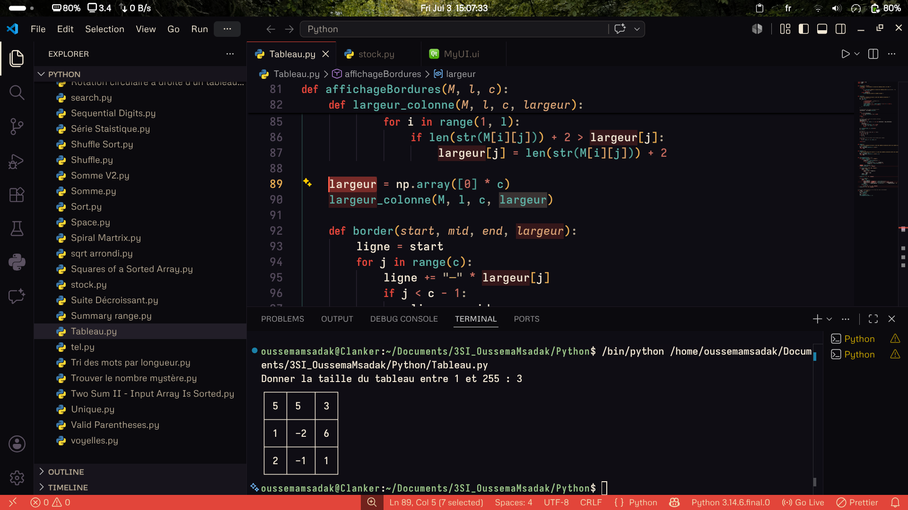
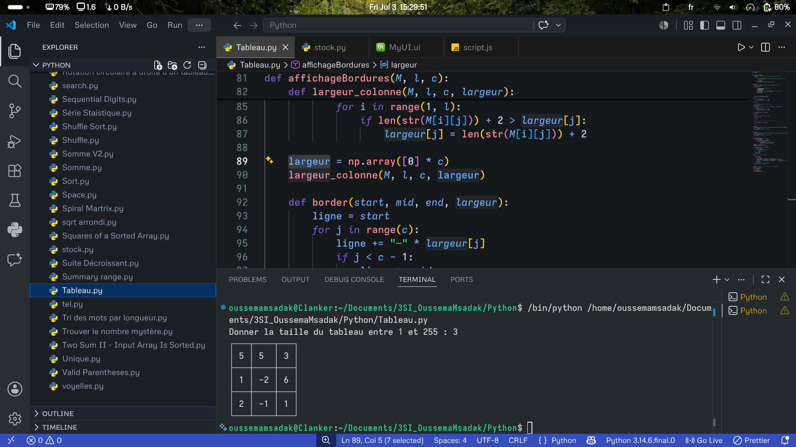
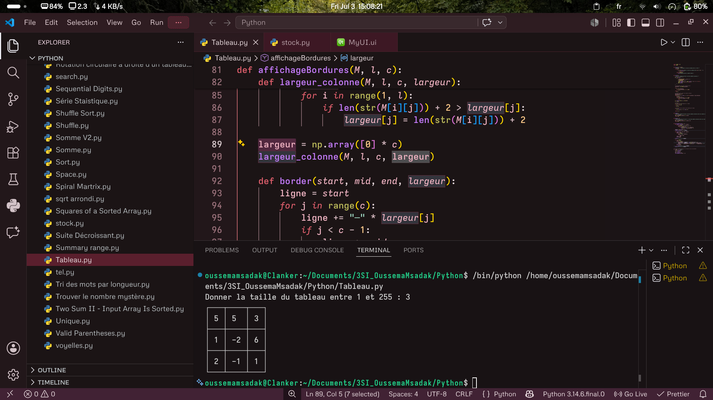

# Clanker's Theme Pack 🌌

[](https://marketplace.visualstudio.com/items?itemName=oussemamsadak.clankers-theme)

A collection of three distinct, high-visibility dark themes for VS Code. Whether you prefer warm desert tones, cool cybernetic slates, or soft pastel aesthetics, this pack has your workspace covered.

---

## 🎨 Themes Included

### 🏜️ Midnight Desert



A rich dark theme that blends a deep midnight canvas with warm desert tones—sand, terracotta, and dusty orange. Sharp red accents are utilized for control keywords, cursors, and critical UI landmarks to maximize scannability.

**Palette Reference**

| Role                      | Hex Code  | Visual Indicator |
| :------------------------ | :-------- | :--------------- |
| **Editor Background**     | `#14121a` | 🌌               |
| **Sidebar / Panel**       | `#110f16` | 🌑               |
| **Main Text & Variables** | `#e8dcc8` | 🌾               |
| **Keywords (Accent)**     | `#c1443c` | 🟥               |
| **Strings**               | `#d9a066` | 🔸               |
| **Functions**             | `#e08a4f` | 📙               |
| **Classes & Types**       | `#e0a458` | 🟨               |
| **Numbers & Constants**   | `#cc7b5c` | 🧱               |
| **Parameters**            | `#d9b382` | 🏼               |
| **Comments**              | `#6f6458` | 🪵               |
| **Cursor & Errors**       | `#e0524a` | 🚨               |

---

### 🌌 Quantum Slate



A cool, slate-toned dark theme enhanced with semantic highlighting[cite: 9]. It swaps out warm earth tones for crisp, vibrant blue and purple syntax accents, providing a highly structured, futuristic workspace layout[cite: 9].

**Palette Reference**

| Role                    | Hex Code  | Visual Indicator |
| :---------------------- | :-------- | :--------------- |
| **Editor Background**   | `#15181b` | ◼️               |
| **Foreground / Text**   | `#c4cbe4` | ◻️               |
| **Keywords & Control**  | `#7d53de` | 🟪               |
| **Variables & Tags**    | `#6aadfa` | 🟦               |
| **Functions & Classes** | `#f78b95` | 🟥               |
| **Constants & Numbers** | `#bbdef0` | 🧊               |
| **Strings**             | `#36e158` | 🟩               |
| **Comments**            | `#5e6572` | 🩶               |

---

### 🍰 Red Velvet



A rich, elegant dark theme focused on soft pinks, deep crimson values, and warm pastel syntax colors. Perfect for developers who want a softer aesthetic that reduces eye strain during long coding sessions.

**Palette Reference**

| Role                    | Hex Code  | Visual Indicator |
| :---------------------- | :-------- | :--------------- |
| **Editor Background**   | `#1a1518` | 🟪               |
| **Sidebar / Panel**     | `#141012` | 🖤               |
| **Main Text**           | `#ebd8de` | 🌸               |
| **Variables**           | `#f5cdd6` | 💮               |
| **Keywords (Soft Red)** | `#d94c5a` | 🌺               |
| **Strings**             | `#f2b5c4` | 🎀               |
| **Functions**           | `#c87a8a` | 🌷               |
| **Classes & Types**     | `#e89eb0` | 💗               |
| **Numbers & Constants** | `#e05f6c` | 💝               |
| **Comments**            | `#8a757a` | 🤎               |
| **Cursor & Selections** | `#e05f6c` | 🎯               |

---

## 🛠️ Customization & Tweaks

If you want to modify any color values or adjust language-specific semantic tokens before building, you can find the individual raw theme configurations in the project directory. For instance, the Quantum Slate variables can be tweaked directly inside `quantum-slate-color-theme.json`[cite: 9].

---

## 📦 Install Locally (Without Publishing)

Ensure you have [Node.js](https://nodejs.org/) installed on your machine, then run the following commands to compile the entire theme pack into a single local extension:

```bash
# Install the VS Code Extension Manager globally
npm install -g @vscode/vsce

# Navigate to the root folder of the theme pack
cd clankers-theme-pack

# Package all three themes into a single installer file
vsce package
```
# Clanker-s-Theme
